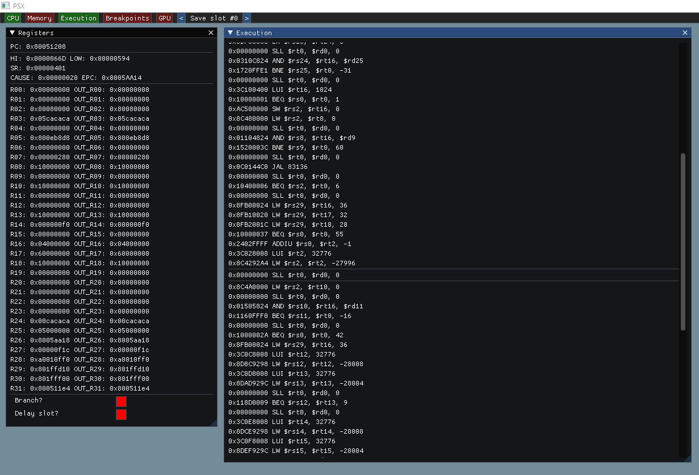

# psx



# Building

The build process was done on a Debian based system (expecting SDL2 to be in `/usr/include/SDL2`)

* Install requierements:
```
sudo apt install libsdl2
```

* Compile:
```
make
```

## For windows

We recommend using the following toolchain: [https://nuwen.net/mingw.html](https://nuwen.net/mingw.html)

# Documentation

Some PDF are already available in the `doc\` folder

* [Open source BIOS](https://github.com/grumpycoders/pcsx-redux/tree/main/src/mips/openbios)
* [Guide to writing a PSX emulator](https://github.com/simias/psx-guide)
* [Various doc](http://hitmen.c02.at/html/psx_docs.html)

**Testing resources**

* [Amidog's tests](https://emulation.gametechwiki.com/index.php/PS1_Tests)
* https://github.com/PeterLemon/PSX
* https://github.com/JaCzekanski/ps1-tests
* https://github.com/simias/psx-hardware-tests/tree/master/tests
* [PSX Demos](https://www.pouet.net/prodlist.php?order=thumbup&platform%5B0%5D=Playstation&page=1)

**Community**

* [/r/emudev](https://www.reddit.com/r/EmuDev/)
* [/r/emudev discord](https://discord.gg/7nuaqZ2)

# Libraries

## GL3W

OpenGL loading library

* [GL3W](https://github.com/skaslev/gl3w)

## SDL2

Low level OpenGL/Direct3D and general UI access

* [SDL2](https://www.libsdl.org/download-2.0.php)

## ImGUI

Easy to use minimalist GUI

* [https://github.com/ocornut/imgui](https://github.com/ocornut/imgui)
* [Memory editor](https://github.com/ocornut/imgui_club)
* [File browser](https://github.com/AirGuanZ/imgui-filebrowser)
